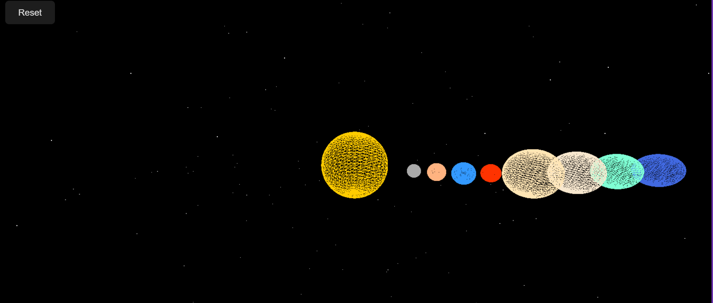

# Solar System

A web-based visualization of the Solar System, allowing you to explore the planets and the sun using realistic textures.

## Features

- Interactive 3D model of the Solar System
- Realistic textures for each planet and the sun
- Written in JavaScript and rendered in the browser

## Directory Structure

```
Solar-System/
│
├── index.html           # Main HTML file for the application
├── script.js            # JavaScript controlling the Solar System logic
└── texture/             # Folder containing texture images for planets and the sun
    ├── earth.jpg
    ├── jupiter.png
    ├── mars.jpg
    ├── mercury.jpg
    ├── neptune.png
    ├── saturn.png
    ├── sun.jpg
    ├── uranus.png
    └── venus.jpg
```

## Preview



## Getting Started

1. Clone this repository:
   ```bash
   git clone https://github.com/hitoriiiiiiii/Solar-System.git
   ```
2. Open `index.html` in your web browser.
3. Explore the Solar System!

## Requirements

- A modern web browser (Chrome, Firefox, Edge, Safari)

Feel free to modify or extend this project!
